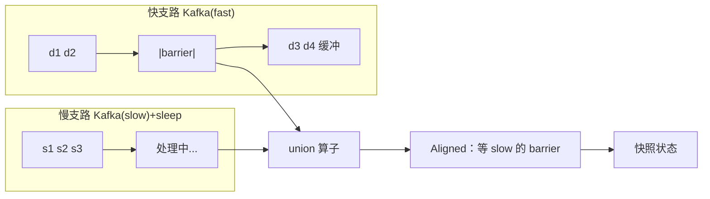

# Flink Checkpoint 机制与超时排查 — 学习指南

> 配套代码：`FlinkCheckpointDemoJob` + `FlinkCheckpointDemoJobTest`  
> 数据源：复用 `StateDemoEvent`（在线教育学习心跳）  
> 拓扑：快/慢双 Kafka 源 **union** → MapState 聚合 → 可选慢 Sink

---

## 读前扫盲：Checkpoint 解决的是「失败后可恢复到哪一刻」

Flink 作业持续运行，状态（聚合中间结果、Kafka offset、定时器等）在内存或 RocksDB 中不断变化。机器宕机、发布重启时，需要从**最近一次一致性快照**恢复，而不是从零开始。

Checkpoint 基于 **Chandy-Lamport 分布式快照算法**：JobManager 向 Source 注入 **checkpoint barrier**（一种特殊标记），barrier 随数据流流过 DAG，每个算子在 barrier 到达时对自己的 **operator state** 做快照。

入门先记住三个结论：

| 结论 | 为什么重要 |
|------|------------|
| Barrier 是快照边界的「切割线」 | barrier 之前的数据已反映在状态中；之后的数据属于下一次快照 |
| **Aligned** 多输入要等齐 barrier | union / join 算子会 **阻塞快输入**，等慢输入的 barrier — alignment time 升高 |
| **Unaligned** 把 in-flight 数据也写入快照 | 不等齐，反压下 CK 不易超时；但快照更大、恢复更复杂 |

本 Demo 用 **双 Kafka union + 慢支路 sleep** 故意拉长 alignment time，在 Flink UI 对照 `aligned` vs `unaligned` 两种模式。

---

## Step 1 原理：Chandy-Lamport Barrier 流过 DAG

### ① 单链路 barrier 传播（简化）

```
Source ──barrier──→ Map ──barrier──→ keyBy/State ──barrier──→ Sink
                         │                    │
                         │  收到 barrier 时：   │
                         │  1. 对齐（多输入时） │
                         │  2. 快照本地状态     │
                         │  3. 向下游广播 barrier│
```

```
时间线（单输入）:

  数据:  d1  d2  |B|  d3  d4  |B'|
                  ↑ CK#1           ↑ CK#2

  CK#1 快照包含: 处理完 d1,d2 后的状态 + Source offset
  d3,d4 属于 CK#1 之后的新数据
```

### ② Aligned Checkpoint：多上游 barrier 对齐

本 Demo：`Kafka(fast) ──┐`
                        `├── union ──→ MapState 算子`
          `Kafka(slow) ──┘`

```
union 算子有 2 个 input channel:

  fast:  d1 d2 |B| d3 d4 d5 |B|
  slow:  s1   s2   s3 |B| s4 |B|
                        ↑
              需等 slow 的 B 到达，fast 上 B 之后的 d3~d5 被缓冲（对齐等待）

  alignment time = 从收到第一个 channel 的 barrier 到所有 channel 齐的时间
```

**反压时**：慢支路 `SlowBranchMapFunction(300ms)` 处理慢 → barrier 在慢支路排队 → **alignment time 飙升** → 易触发 `checkpoint timeout`。



### ③ Unaligned Checkpoint

```
barrier 到达时 **不阻塞** 快 channel 的 in-flight 数据；
把 channel 中 barrier 前后的数据分段，与状态一并异步写入存储。

  优点：反压 / 慢输入下 checkpoint 仍能完成
  代价：快照含更多 in-flight 数据 → state size 增大；恢复时要重放 channel 数据，逻辑更复杂
```

| 维度 | Aligned | Unaligned |
|------|---------|-----------|
| alignment time | 反压下可能很长 | 趋近 0 |
| 快照大小 | 较小 | **较大**（含 in-flight） |
| 恢复复杂度 | 低 | **较高** |
| 适用 | 低延迟、状态适中、反压不严重 | 反压严重、CK 频繁超时 |

**加分点取舍**：生产上先 **Aligned + 调 alignment timeout + 增量 CK**；仍超时再开 Unaligned，并监控快照体积增长。

---

## Step 2 实操：本地 Job + UI 观察

### 创建 Topic

```bash
kafka-topics.sh --create --topic test_flink_checkpoint --partitions 2 \
  --bootstrap-server 192.168.1.124:9092
kafka-topics.sh --create --topic test_flink_checkpoint_slow --partitions 1 \
  --bootstrap-server 192.168.1.124:9092
```

### 启动 Job（对比实验）

```bash
# 实验 A：Aligned + 慢支路 300ms → alignment time 升高
org.example.job.checkpoint.FlinkCheckpointDemoJob aligned 300 0 hashmap

# 实验 B：Unaligned + 同样慢支路 → CK 更易成功
org.example.job.checkpoint.FlinkCheckpointDemoJob unaligned 300 0 hashmap

# 实验 C：慢 Sink 200ms → sync 阶段变长（模拟 2PC）
org.example.job.checkpoint.FlinkCheckpointDemoJob aligned 0 200 rocksdb
```

### 发送测试数据

```bash
mvn test -Dtest=FlinkCheckpointDemoJobTest#sendCheckpointDemoEvents
```

### Flink UI 观察路径

**http://localhost:8081** → Jobs → Running → **Checkpoints** 标签页

| UI 指标 | 含义 | 本 Demo 如何放大 |
|---------|------|------------------|
| **Alignment Duration** | 多输入 barrier 对齐等待时间 | `aligned 300 0` + Phase2 慢支路 burst |
| **Sync Duration** | 状态同步到本地快照结构的耗时 | 大 MapState（Phase3 多学员） |
| **Async Duration** | 异步上传到 HDFS/S3 的耗时 | `rocksdb` + 磁盘慢时明显 |
| **State Size** | 各算子快照字节数 | Phase3 `state-growth` 事件 |
| **End to End Duration** | 整次 CK 总时长 | 超 `checkpoint.timeout` 则失败 |

### 控制台日志

```
[CK-STATE] ... mapEntries=3 | lastCkId=5
[CK-COMPLETE] subtask=0 checkpointId=6 mapEntries≈8
[CK-ABORTED] subtask=1 checkpointId=7（可能超时或对齐失败）
```

### 关键配置（`CheckpointConfigurator`）

```java
env.enableCheckpointing(10_000);  // 间隔 10s，便于 UI 观察
ck.setCheckpointTimeout(60_000);
ck.setAlignmentTimeout(Duration.ofMillis(30_000));
ck.setMinPauseBetweenCheckpoints(5_000);
ck.setMaxConcurrentCheckpoints(1);
ck.enableUnalignedCheckpoints();  // 仅 unaligned 模式
```

---

## Step 3 排查清单：Checkpoint 超时 6 类根因

| # | 根因 | UI/日志信号 | 排查动作 | 对策 |
|---|------|-------------|----------|------|
| ① | **反压（对齐慢）** | `backPressure=HIGH`；alignment duration 接近 timeout | Flink UI → Back Pressure；慢算子 flame graph | 优化热点算子；开 **Unaligned**；调大 `alignment-timeout` |
| ② | **状态过大** | state size 持续增长；sync duration 高 | 看各算子 state bytes；heap dump / RocksDB 目录 | **增量 CK**；State **TTL**；拆算子减状态 |
| ③ | **磁盘/存储慢** | async duration 高；CK 存储 HDFS 慢 | 看 TaskManager 磁盘 IO；CK 路径网络 | 换 SSD；独立 CK 目录；调 `state.checkpoints.dir` |
| ④ | **barrier 对齐时间长** | alignment >> sync | 找 union/join 慢输入；对照本 Demo 慢支路 | `withIdleness` 不能解决 CK；拆慢源或 Unaligned |
| ⑤ | **GC** | TM 日志 Full GC；CK 期间 STW | GC 日志；`heap.used` 监控 | 增大 heap / 换 RocksDB；减少大对象状态 |
| ⑥ | **外部 Sink 慢（2PC）** | sink 算子 sync 高；exactly-once 开启时 | 看 Kafka/JDBC Sink pre-commit 耗时 | 本 Demo `sinkSlowMs=200`；调 Sink 批次；at-least-once 权衡 |

**记忆口诀**：**反、大、盘、齐、GC、Sink** — 六字对应上表。

---

## Step 4 调优手段

| 手段 | 配置 | 说明 |
|------|------|------|
| 增量 Checkpoint | `EmbeddedRocksDBStateBackend(true)` | 只传变更 SST，大状态必备 |
| 调大超时 | `execution.checkpointing.timeout: 10min` | 治标不治本，先找根因 |
| Unaligned | `execution.checkpointing.unaligned: true` | 反压下 CK 救星；监控快照体积 |
| 减小状态 | `StateTtlConfig`、清理无用 key | 日切后过期 session 状态 |
| 对齐 buffer 超时 | `alignment-timeout: 30s` | 超时后转 aligned 失败或触发 unaligned（版本相关） |
| 间隔与暂停 | `min-pause-between-checkpoints` | 避免 CK 重叠打满 IO |
| 单并发 CK | `max-concurrent-checkpoints: 1` | 大状态默认 |

```yaml
# flink-conf.yaml 示例
execution.checkpointing.interval: 60s
execution.checkpointing.timeout: 600s
execution.checkpointing.unaligned: true
execution.checkpointing.alignment-timeout: 30s
execution.checkpointing.max-concurrent-checkpoints: 1
state.backend: rocksdb
state.backend.incremental: true
```

---

## Step 5 面试话术

**问：Checkpoint 老超时，你从哪查到哪？**

> 我按 **UI 指标 → 根因 → 对策** 顺序排查。  
> 1. 打开 Flink UI **Checkpoints** 页，看失败 CK 的 **alignment / sync / async** 哪段最长。  
> 2. **Alignment 长** → 看多输入 union 是否反压、慢支路是否拖后腿；本仓库 Demo 就是 `aligned + slowBranch 300ms` 复现。对策：优化慢算子、调 `alignment-timeout`、或开 **Unaligned**。  
> 3. **Sync 长 + state size 大** → 状态膨胀或 HashMap 后端；换 **RocksDB + 增量 CK**，加 **State TTL**。  
> 4. **Async 长** → CK 存储或磁盘 IO；换路径、SSD、检查 HDFS 慢节点。  
> 5. 看 TM **GC 日志** 是否 Full GC 与 CK 时间重合。  
> 6. **Sink 算子 sync 高** 且 exactly-once → JDBC/Kafka **2PC pre-commit** 慢；本 Demo `sinkSlowMs` 模拟。  
> 最后才调大 `checkpoint.timeout`，并说明是临时手段。

**追问：Aligned 和 Unaligned 怎么选？**

> 默认 Aligned，快照小、恢复简单。反压导致 alignment 经常顶满 timeout 时再开 Unaligned，并接受快照变大；同时监控恢复时长和存储成本。

---

## 验收清单

| # | 验收项 | 验证方式 |
|---|--------|----------|
| ① | 能画 barrier 对齐图 | 本文 Step1② + mermaid |
| ② | 能背 6 类根因 + 对策 | Step3 表 + 单测 `checkpointTimeout_sixRootCausesChecklist` |
| ③ | UI 观察 alignment/sync/async | Step2 实操 |
| ④ | Aligned vs Unaligned 取舍 | Step1③ + 单测 `tuningOptions_coverAlignedVsUnalignedTradeoff` |

---

## Step 7 在线教育典型业务案例（Checkpoint 三角）

> 以下三个场景是在线教育平台里 **Checkpoint 问题最高发** 的业务，分别对应：  
> **union 多源对齐慢** / **日窗口大状态** / **exactly-once 写库慢**。  
> 与《FlinkStateDemoGuide》《FlinkWatermarkDemoGuide》互补：State 讲存什么，Watermark 讲何时触发，本文讲 **如何快照与恢复**。

---

### 案例一：行为流 + 教务流 union — alignment time 飙升

#### 业务背景

「学员今日学习时长」Job **union** 两路 Kafka：
- **fast**：App 视频心跳，3k/s
- **slow**：教务 LMS 批量回流，经 ETL 后 10~50/s，但 **每条处理 200ms**（解析、补字段）

与 Demo **完全一致**：`test_flink_checkpoint` + `test_flink_checkpoint_slow`。

#### 故障现象

```
CK#42 alignment duration = 4min 58s → 超过 checkpoint.timeout=5min → FAILED
Job 反复从 40min 前状态恢复 → 家长日报重复计算 / 漏算
```

#### 架构

```
Kafka(heartbeat) ──→ WM(30s) ──┐
                                 ├── union → keyBy(studentId) → MapState(日时长)
Kafka(lms_sync)  ──→ 慢 map ───┘
```

#### 三要素

| 维度 | 分析 |
|------|------|
| 根因 | ① 反压 + ④ barrier 对齐 — 慢支路拖 union |
| 信号 | UI alignment duration 高；backPressure=HIGH on union |
| 对策 | 优先 **拆 Job**（行为单算、教务离线 join）；若必须 union → **Unaligned** + `alignment-timeout` |

**与 Demo 映射**：`FlinkCheckpointDemoJob aligned 300 0` = 本案例复现。

#### 踩坑

- 误以为 `withIdleness` 能修 CK — idleness 只管 WM，不管 barrier 对齐。
- union 是 CK 对齐的「最弱环」—— 与 WM min 同理。

---

### 案例二：日窗口 MapState — 状态过大 + sync 慢

#### 业务背景

按 `studentId` 维护 **Tumbling 1day** 学习时长 `MapState<courseId, sec>`。晚高峰 50 万在线学员，日切后状态未 TTL，**单 key 下数百课程 entry**。

#### 故障现象

```
state size 单算子 8GB → sync duration 3min → async 再 2min → 总 CK > timeout
```

#### 三要素

| 维度 | 分析 |
|------|------|
| 根因 | ② 状态过大 |
| 信号 | state size 线性涨；sync >> alignment |
| 对策 | **RocksDB + 增量 CK**；`StateTtlConfig` 日切 +2h 过期；避免 `ValueState<HashMap>` 整表序列化 |

**与 Demo 映射**：Phase3 `state-growth` 多学员多课程；`rocksdb` 启动参数。

#### 运维告警

| 监控项 | 阈值 |
|--------|------|
| 单算子 state size | > 2GB 告警 |
| sync duration P99 | > 60s |
| CK 失败率 | > 0 持续 3 次 |

---

### 案例三：完课记录写 MySQL — Sink 2PC 拖长 sync

#### 业务背景

完课事件经 Flink 聚合后 **JDBC Sink exactly-once** 写教务库 `completion_record`。每条 pre-commit 50~100ms，窗口触发 burst 500 条/s。

#### 故障现象

```
Sink 算子 sync 阶段占 CK 总时长 70%；alignment 正常仍超时
```

#### 三要素

| 维度 | 分析 |
|------|------|
| 根因 | ⑥ 外部 Sink 慢 |
| 信号 | sink subtask sync 高；Kafka offset 提交慢（若 Kafka sink） |
| 对策 | 批量写、异步 Sink、at-least-once 权衡；本 Demo `sinkSlowMs=200` 模拟 |

**与 Demo 映射**：`FlinkCheckpointDemoJob aligned 0 200 rocksdb`。

#### 踩坑

- 只调大 timeout 不写优化方案 — 面试要说到 **根因是 2PC 不是 alignment**。
- 完课写库与实时大屏可 **拆 Sink**：大屏 at-least-once，账务 exactly-once。

---

### 三案例对照总表

| 案例 | CK 主题 | 典型症状 | 核心对策 | 与 Demo 对应 |
|------|---------|----------|----------|--------------|
| 行为+教务 union | **alignment 慢** | alignment≈timeout | Unaligned / 拆 Job | `aligned 300 0` |
| 日窗口 MapState | **state 过大** | sync 高、state GB 级 | RocksDB 增量 + TTL | Phase3 + `rocksdb` |
| JDBC 完课 Sink | **2PC 慢** | sink sync 高 | 批量 / 拆一致性级别 | `sinkSlowMs=200` |

### 与其他 Demo 的关系

| Demo | Checkpoint Demo |
|------|-----------------|
| State：MapState 怎么存 | 快照时 MapState 如何序列化到 CK |
| Watermark：union min WM | union **barrier 对齐**（不同机制，同拓扑弱点） |
| Window：日窗口聚合 | 大窗口状态 → CK sync 变慢 |

---

## 运行速查

```bash
# 1. 启动 Job（本地 Web UI 8081）
org.example.job.checkpoint.FlinkCheckpointDemoJob aligned 300 0

# 2. 发数据
mvn test -Dtest=FlinkCheckpointDemoJobTest#sendCheckpointDemoEvents

# 3. 单测（无需 Kafka）
mvn test -Dtest=FlinkCheckpointDemoJobTest

# 4. 对比 unaligned
org.example.job.checkpoint.FlinkCheckpointDemoJob unaligned 300 0
```
